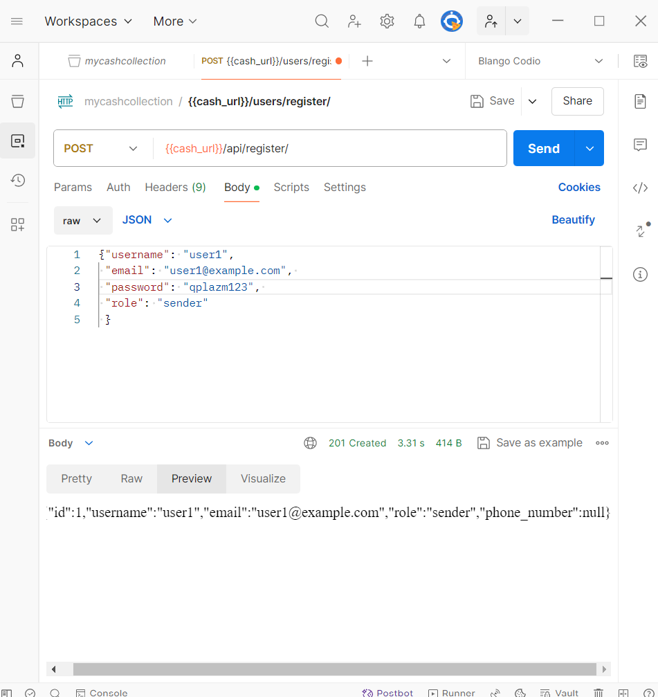
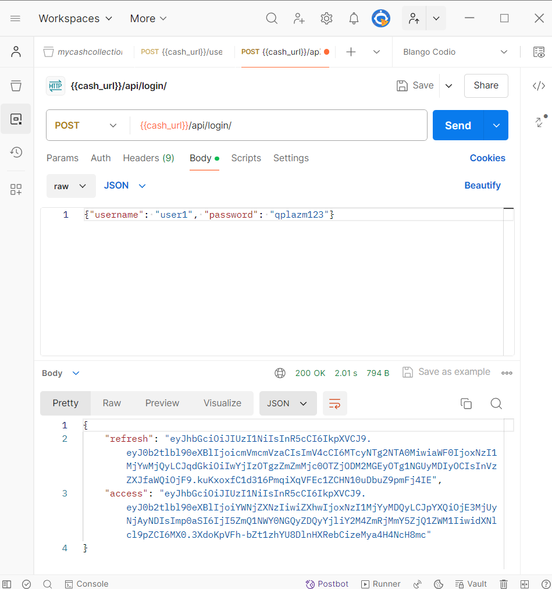
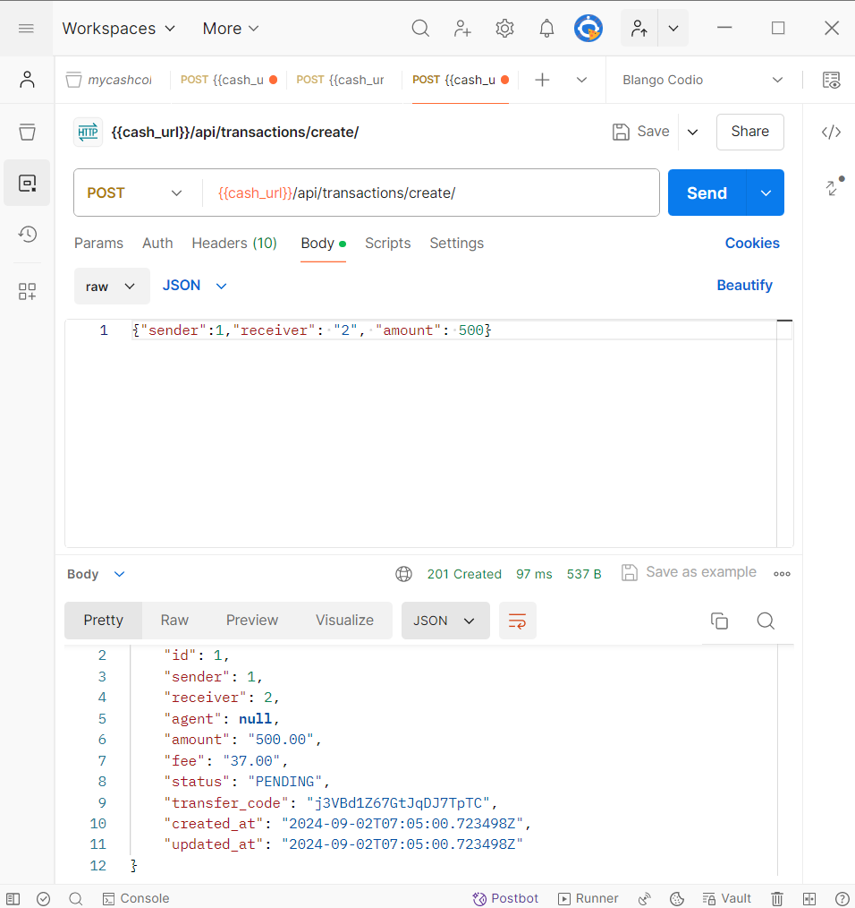

# MyCash

MyCash is a Django-based money transfer system that allows users to send and receive money, with features like user management, transaction processing, escrow, and in-app notifications.

## Table of Contents

1. [Features](#features)
2. [Installation](#installation)
3. [Usage](#usage)
   - [User Management](#user-management)
   - [Transaction Management](#transaction-management)
   - [Escrow System](#escrow-system)
   - [Notification System](#notification-system)
4. [API Endpoints](#api-endpoints)
5. [Screenshots](#screenshots)

## Features

- User registration, authentication, and role management (sender, receiver, agent)
- Transaction creation, confirmation, and completion
- Escrow system for holding funds during transactions
- In-app notification system for transaction updates

## Installation

1. Clone the repository:
2. Create a virtual environment and activate it
3. Install the required dependencies
4. Apply the database migrations
5. Create a superuser account
6. Start the development server

The application will be available at `http://127.0.0.1:8000/`.

## Usage

### User Management

- **Register a new user**: `POST /api/register/`
- **Login a user**: `POST /api/login/`
- **Update a user's profile**: `PATCH /api/profile/update/`

### Transaction Management

- **Create a new transaction**: `POST /api/transactions/create/`
- **Confirm a transaction**: `PATCH /api/transactions/confirm/<transaction_id>/`
- **Complete a transaction**: `PATCH /api/transactions/complete/<transaction_id>/`

### Escrow System

- **View escrow details**: `GET /api/transactions/escrow/<escrow_id>/`

### Notification System

- **Get user notifications**: `GET /api/notifications/`
- **Mark a notification as read**: `PATCH /api/notifications/mark_read/`

## API Endpoints

Refer to the [API documentation](API_DOCUMENTATION.md) for a complete list of available endpoints and their usage.

## Screenshots

Here are some screenshots of the API calls using Postman:

1. **Register a new user**: `POST /users/register/`

2. **Login a user**: `POST /users/login/`

3. **Create a new transaction**: `POST /transactions/create/`

